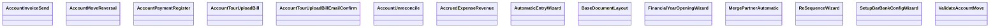

# Wizards

Transient models exposed as UI wizards in account.

```mermaid
classDiagram
    class AccountInvoiceSend
    class AccountMoveReversal
    class AccountPaymentRegister
    class AccountTourUploadBill
    class AccountTourUploadBillEmailConfirm
    class AccountUnreconcile
    class AccruedExpenseRevenue
    class AutomaticEntryWizard
    class BaseDocumentLayout
    class FinancialYearOpeningWizard
    class MergePartnerAutomatic
    class ReSequenceWizard
    class SetupBarBankConfigWizard
    class ValidateAccountMove
```
