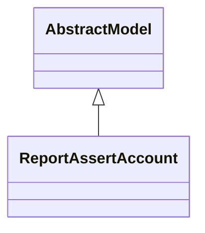

# Reports

Report definitions and templates in account_test.

## Available Reports

### PDF/Document Reports
- **Accounting Tests** (PDF/Print)

## Report Files

- **accounting_assert_test_reports.xml** (XML template/definition)
- **__init__.py** (Python logic)
- **report_account_test.py** (Python logic)
- **report_account_test_templates.xml** (XML template/definition)

## Notes
- Named reports above are accessible through Odoo's reporting menu
- Python files define report logic and data processing
- XML files contain report templates, definitions, and formatting
- Reports are integrated with Odoo's printing and email systems
